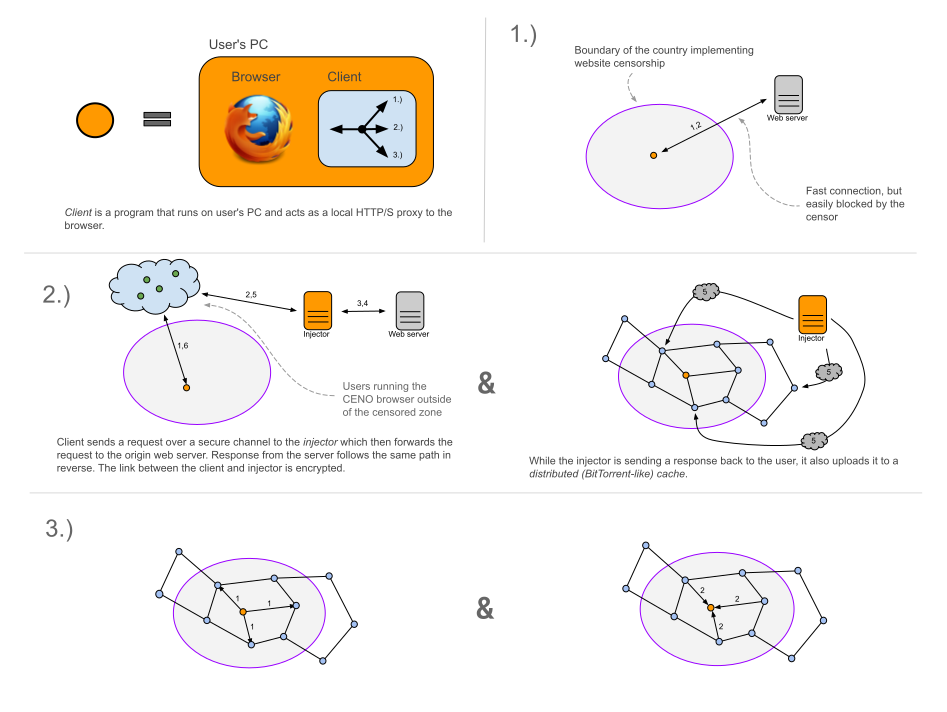

# Censorship.no!

CENO (short for [Censorship.no!][]) is a mobile Web browser using a novel approach to circumventing Internet censorship, targeting to enable unfettered access to the World Wide Web for netizens operating in highly restrictive Internet environments.

[Censorship.no!]: https://censorship.no/

CENO users do not need to know a friendly proxy server in the uncensored zone in order to bypass local filtering — setting CENO apart from most other circumvention initiatives.  CENO is being built in expectation of aggressive Internet filtering and the establishment of [national intranets][] to fence off nations from the Web.

[national intranets]: http://en.wikipedia.org/wiki/National_intranet

CENO is based on [Firefox for Android][] (a.k.a. Mozilla Fennec), extended to make use of the innovative [Ouinet library][], which allows web content to be served with the help of an entire network of cooperating nodes using peer-to-peer routing and distributed caching of responses.

[Firefox for Android]: https://www.mozilla.org/firefox/android/
[Ouinet library]: https://github.com/equalitie/ouinet/

The *Censorship.no!* project is run by [eQualitie][] in support of Articles 18, 19 and 20 of the [Universal Declaration of Human Rights]().  Please contact <cenoers@equalit.ie> in case of doubt or for further information.

[eQualitie]: https://equalit.ie/
[Universal Declaration of Human Rights]: https://www.un.org/en/universal-declaration-human-rights/

# Current Status

CENO is currently in its ALPHA stage. It is being tested in censored countries
and while there are still many more-or-less small things that need to be done
before we move to BETA stage.

# Warning!

CENO is still **experimental ALPHA software**.  We offer it with the best intention that it is useful to you, but due to its highly innovative nature and stage of development, you may expect some issues while using it.  In particular:

#### Complete blackout
  - The availability of web content (especially under censorship conditions) may vary widely with factors like web site configuration, network capacity, and the presence, connectivity and browsing behavior of other CENO users.  The behavior of the mechanisms currently used to share content between users may be erratic.
  - The application may use substantial device resources like network traffic, disk space and battery power.
  - Last but not least, **CENO is not an anonymity tool**: information about your browsing might be leaked to other CENO users, as well as the fact that your application is providing particular web content to others.  Content accessed with the application may stay in storage in clear text for some time (continue reading for more information on this).  Other security or privacy-affecting issues might exist.

We recommend that you use this tool in controlled environments and **only assume reasonable risks**.  eQualitie and its associates decline any legal responsibility derived from the use of this software.

## What works

Basic functionality is in place and it currently being tested. Provided that
there is enough bridges outside of censored countries, and that those countries
haven't sealed off their international communication completely, CENO users are
able to connect to blocked websites and then share the content to other peers.

When users start the CENO browser, they automatically become part of the CENO
network. This means that - when possible - these devices shall act as temporary
VPNs for people who can't access blocked websites.

In addition any publicly available content that any CENO user visits shall be
shared in a BitTorrent like fashion to others.

## What does not work (yet)

As mentioned, CENO is still in its alpha stage. Here is a list of important
information CENO users need to know:

### Battery and data usage

To prolong availability of CENO bridges, the CENO browser shall continue
working even when it goes to the background. We have not yet put in place
functionality which would disable all networking operations when the device
switches to cellular internet, nor when it is disconnected from the charger.

Until we implement this functionality, to preserve the device batter and
network bandwidth, users need to explicitly disable CENO either by shutting it
down from Android's list of running applications, or by tapping the "Tap to
stop CENO" button from the notification area.

### CENO is not an anonymizer

CENO users should also be aware of the fact that CENO is not a network to
anonymize users such as Tor or I2P. More akin to BitTorrent, IP addresses or
users sharing particular content is publicly visible by anyone understanding
the internals of the BitTorrent DHT protocol.

### Complete blackout

At the moment, CENO relies on bridge nodes whose IP addesses are not black
listed by countries with hars censorship (hence why support from ordinary
people is so important to us). However, in the event of a complete internet
blackout where no data can pass the internation boundary, CENO will cease to
work.

In the future we're hoping to address this problem by:

1. Letting users "import" web content by other means than the Internet into the
   censored zones and then disseminate it in a distributed fashion.
2. Modifying the protocol to find alternative routes to relay the traffic
   outside of the censored country and back if one exists. 
# Features

  - Browse with normal speeds when Internet access is not censored.
  - Still reach sites (with slower speeds) when they have been selectively censored (either via DNS or IP).
  - Retrieve directly from other users and naturally browse web pages that they visited previously, even when the country's Internet access has afterwards been completely cut off.
  - Retrieve and naturally browse content inserted off-line (like web site captures) under complete national Internet disconnection.

# Where to get it

The CENO browser for Android is available [in Google Play](https://play.google.com/store/apps/details?id=ie.equalit.ceno "CENO app in Google Play") and [in Paskoocheh](https://paskoocheh.com/tools/124/android.html "CENO app in Paskoocheh").  The Android package (APK) is also available [in GitHub](https://github.com/censorship-no/ceno-browser/releases "CENO app in GitHub").

CENO is completely Free/Libre/Open Source Software.  If you are interested in its source code please check the following Git repositories:

  - Browser components: [package builder](https://github.com/censorship-no/ceno-browser), [Firefox fork](https://github.com/censorship-no/gecko-dev/tree/ceno), [included extensions](https://github.com/censorship-no/ceno-distribution), [settings extension source](https://github.com/censorship-no/ceno-ext-settings)
  - [Ouinet source](https://github.com/equalitie/ouinet)
  - Other project-related repositories: [Censorship.no! GitHub organization](https://github.com/censorship-no)

You may also be interested in the (no longer maintained) [previous incarnation of CENO](https://github.com/censorship-no-archive/ceno1), built on the [Freenet][] anonymous file sharing and content publishing network.  Other inactive project-related repositories can be found at the [Censorship.no! archive](https://github.com/censorship-no-archive).

[Freenet]: https://freenetproject.org/

# How does it work?

When you access or *request* a web page using CENO, the application first looks at the browser request to decide whether the page seems *cacheable*, i.e. potentially safe to be saved and publicly shared with other CENO users (requests with e.g. authentication tokens, cookies or dynamic connections are not).  Then it attempts to retrieve the page using several *mechanisms* until one of them succeeds:

  - It first attempts to retrieve the page straight from its **origin** (i.e. web server) as a normal browser would do.
  - If that fails, and the page seems cacheable, the application tries to get it from the **distributed cache**, i.e. from other CENO users that may have previously accessed it.  If it succeeds, the application itself starts sharing the page with other users.
  - If retrieving a cacheable page from the distributed cache fails, the application tries to retrieve it via an **injector**, a machine sitting in the uncensored zone which provides the application with the page content.  If the injector deems the *response* amenable to do so, it also provides additional information allowing users to share the page (which the application starts doing straight away).
  - If that fails, or if the page was not cacheable, the application uses the injector as a **proxy** to access content privately.  Neither the injector nor the application share the content publicly (in fact, when accessing secure web content, the injector is not even able to see the request and response themselves).

Users can selectively disable each of these mechanisms so that they are skipped altogether.  In the CENO application menu, just select the *CENO* entry and use the check boxes corresponding to the different mechanisms.

# Caching

Once a particular content has crossed the boundary to a censored zone, it is furhter distributed in a BitTorrent-like fashion. This has 

# On content storage and availability

As you can see, your application will only be sharing *content that you have previously accessed*, and it will do that while it is running.  Conversely, if access to a page's origin or to the injector is not possible, the page will only be available if other users who have previously accessed the same page are still running their application.  The more applications actively sharing a page, the more chances for other users to get it.

Content does not stay in your device forever.  After your application has stored more than 10 gigabytes (this is not configurable for the moment), content which has not been accessed for the longest time (either by you or other users via your application) is removed to make space for new content.

If you want to remove all stored pages, you can use the standard procedures to delete the application's data in Android.  Be warned that currently *this will also remove other information* like favorites and browsing history from CENO.  We may later on add a way to remove stored pages without having to delete all application data.

----

# Feedback

As mentioned, we're currently in a testing phase and are happy to receive
positive and negative feedback as well as questions at <cenoers@equalit.ie>.

# Screenshots

Can be found in the [images/screenshots folder](images/screenshots)

# About eQualitie

[eQualitie][] develops open and reusable systems with a focus on privacy, online security, and information management.  Our goal is to create accessible technology and improve the skill set needed for defending human rights and freedoms in the digital age.

[eQualitie]: https://equalit.ie/
