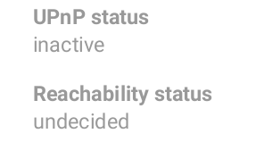
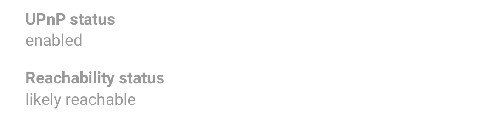

# Helping other CENO users browse the Web

A peer-to peer-network is built from every node connected to it (yes, that means you as well!) The more nodes, the stronger and more versatile the network becomes. If you are running the CENO Browser from a country that does not censor the internet (or not as heavily as some), consider helping other CENO users by becoming a **bridge** node. You will then route traffic between clients living in heavily censored countries and the CENO network injectors. You wont be able to see this traffic (it will be sent through an encrypted tunnel) nor will any of this traffic remain on your device. 

**Note:** enabling UPnP on your Wifi router may expose some of the devices on your network to external interference. Please make yourself [aware of the risks](https://www.howtogeek.com/122487/htg-explains-is-upnp-a-security-risk) and also consider using alternative methods as explained below.

# How to become a CENO bridge

This functionality is already built into the CENO browser client. Your phone will need to be connected to a WiFi network that has [UPnP](https://en.wikipedia.org/wiki/Universal_Plug_and_Play) enabled. The **CENO Settings** menu will indicate the UPnP status of your phone. Note that many WiFi routers switch this option **on** by default. 

Indicates that UPnP is not enabled on your WiFi router. 

Indicates that UPnP is likely working and CENO is currently verifying connectivity.

Indicates that UPnP is working and you can bridge connections for other CENO users.

# Enabling UPnP on your WiFi router

There are many WiFi routers on the market and each has their own particular features. Herein a list of popular manufacturers' instructions for enabling UPnP:

* [Linksys](https://www.linksys.com/us/support-article?articleNum=138290)
* [D-Link](https://eu.dlink.com/uk/en/support/faq/routers/wired-routers/di-series/how-do-i-enable-upnp-on-my-router)
* [Huawei](https://consumer.huawei.com/ph/support/content/en-us00275342/)
* [Xfinity](https://www.xfinity.com/support/articles/configure-device-discovery-for-wifi)
* [Tp-link](https://community.tp-link.com/us/home/kb/detail/348)

# Alternative methods to allow CENO bridging

