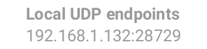

# Helping other CENO users browse the Web

A peer-to peer-network is built from every node connected to it (yes, that means you as well!) The more nodes - the stronger and more versatile the network becomes. If you're running the CENO Browser from a country that does not censor the internet (or not as heavily as some), consider helping other CENO users by becoming a **bridge** node. You will then begin to route traffic between clients living in heavily censored countries and the CENO network injectors. You wont be able to see their traffic (it will be sent through an encrypted tunnel) nor will any of this traffic remain on your device.

## How to become a CENO bridge

This functionality is already built into the CENO browser client. Your phone will need to be connected to a WiFi network that has [UPnP][] enabled. The *CENO Settings* page will indicate the UPnP status on your network.

[UPnP]: https://en.wikipedia.org/wiki/Universal_Plug_and_Play

> **Note:** Enabling UPnP on the Wifi router may expose devices on your network to external interference. Please make yourself [aware of the risks][upnp-risks] and also consider using alternative methods as explained below.

[upnp-risks]: https://www.howtogeek.com/122487/htg-explains-is-upnp-a-security-risk

Indicates that UPnP is not enabled on your WiFi router.

Indicates that UPnP is likely working and CENO is currently verifying connectivity.

Indicates that UPnP is working and you can bridge connections for other CENO users.

## Enabling UPnP on your WiFi router

There are many WiFi routers on the market and each has their own particular features. Herein a list of some manufacturers' instructions for enabling UPnP:

  * [Linksys](https://www.linksys.com/us/support-article?articleNum=138290)
  * [D-Link](https://eu.dlink.com/uk/en/support/faq/routers/wired-routers/di-series/how-do-i-enable-upnp-on-my-router)
  * [Huawei](https://consumer.huawei.com/ph/support/content/en-us00275342/)
  * [Xfinity](https://www.xfinity.com/support/articles/configure-device-discovery-for-wifi)
  * [Tp-link](https://community.tp-link.com/us/home/kb/detail/348)

## Alternative methods to allow CENO bridging

Instead of enabling UPnP on your router, you can create a port forwarding rule, to make sure that connections from the CENO network are forwarded to your smartphone. You will need to login to the router's administration interface and locate the *port forwarding* option. To see which IP address you need to forward the connections to and the relevant port, open the **CENO Settings** menu and look under the *Local UDP endpoint(s)*.

> **Note:** The port forwarding must be for the UDP protocol (not TCP). Your smartphone's local network IP address may change from time to time (unless you know how to allocate a static address to the device) so you should periodically review the CENO settings menu to see that the phone is reachable to the CENO network.
