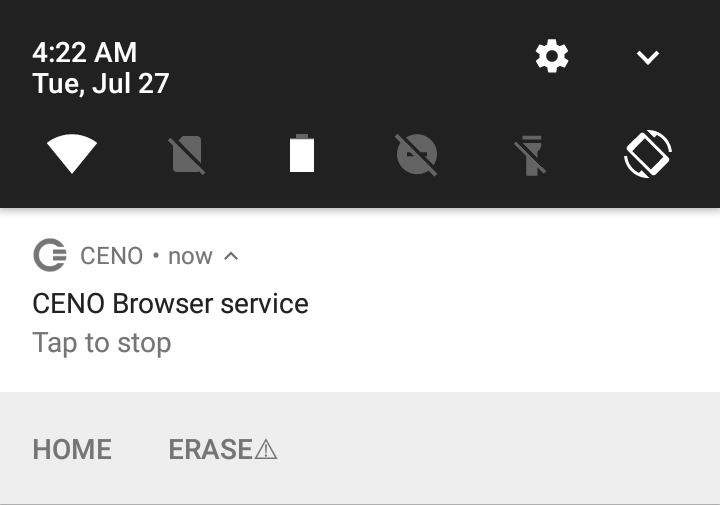
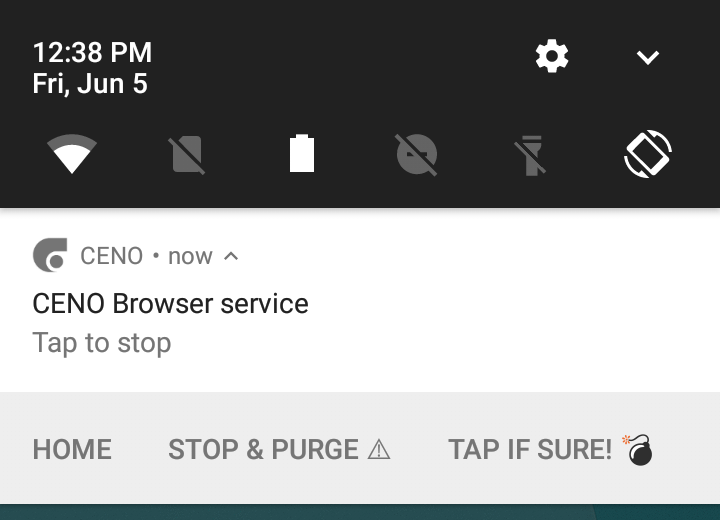

# Installing Ceno

Ceno Browser can be installed via the following means:

- [Google Play][ceno-gplay] (*Ceno Browser* from *eQualitie*): the recommended source for most Android users.
- [Gitlab][ceno-gh]: for Android devices without Google Play.
- [Paskoocheh][ceno-pask]: for users in countries blocking access to the previous channels.

[ceno-gplay]: https://play.google.com/store/apps/details?id=ie.equalit.ceno
[ceno-gh]: https://gitlab.com/censorship-no/ceno-browser/-/releases
[ceno-pask]: https://paskoocheh.com/tools/124/android.html

Ceno requires an ARM64 or Neon-capable ARM32 device running at least Android 4.1 Jelly Bean, thus most mobile devices released from late 2012 onward should work.  Ceno needs *no special permissions* to run.

> **Warning:** Please be *extremely skeptical* about installing Ceno Browser from sources other than the ones listed above.  Because of the application's nature, their potential users may become a target for all kinds of fake or manipulated versions used to violate user privacy or attack other Ceno and Ouinet users.  If in doubt, please contact <cenoers@equalitie.org> before installing a suspicious app.

## Stopping Ceno completely

Every time you start the app, a Ceno icon will appear on your device's notification bar.  This icon represents the *Ceno Browser service*, which is the part of Ceno that runs permanently (even when you are not browsing) and allows other clients to use your device as a bridge and retrieve content from it at any time.

Since running such service uses network and processor resources, you may want to stop it whenever you are on the move (i.e. not connected to Wi-Fi or far from a charger).  Tapping on the notification attached to the icon will stop both Ceno and its service at once (until you open Ceno again).

## Purging all Ceno data (the "panic button")

The *Ceno Browser service* notification shown above includes a few accompanying actions which can be triggered by tapping on them.  The *Home* action will just open Ceno with a new public browsing tab showing its home page.  The *Erase* action demands more explanation.

> **Note:** If the actions below the notification are not visible, drag the notification from its center towards the bottom to unfold it.  If you can only see the *Home* action, your device may be too old to support the *Erase* action.

Shall you ever need to quickly stop Ceno and clear absolutely all data related to it (not only cached content, but also settings like favorites, passwords and all browsing history), you can tap on *Erase*.  To avoid losing your data accidentally, this will not remove anything yet, but just show an additional action for a brief moment, as pictured below:

If you tap on the *Yes* action, Ceno will be stopped and all its data removed *without further questions*, effectively leaving your device as if Ceno had never been used.

If you do not tap on the action, it will go away in a few seconds.

> **Note:** The method described above requires that Ceno be running on your device.  To accomplish the same effect when Ceno is stopped, you can use Android's general *Settings* page and, under the *Apps* entry, choose Ceno and then *Clear data*.
>
> As a harsher alternative, you may completely uninstall the app.

> **Warning:** Android may still keep other traces of having used an app besides its data, for instance in its system log.
