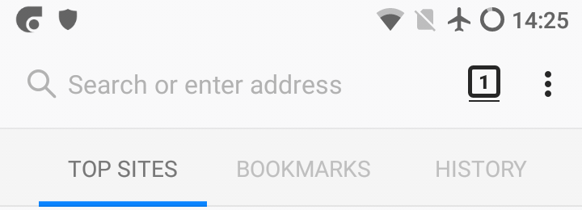
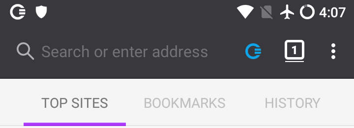

# Using public or private browsing

As described [in a previous section](../concepts/public-private.md), CENO has two different modes of operation depending on whether you want to share with others the content that you browse (public browsing) or not (private browsing).

This setting applies *to each tab* that you open in the browser, i.e. you can have public browsing tabs and private browsing tabs.  The default in CENO whenever you start it or open a new tab (using *New tab* in the app's main menu) is to use public browsing.  To open a new tab in private browsing mode, just choose *New private tab* in the main menu.

You can tell public tabs from private ones because the former have a lighter (or white) tool bar:

In contrast, the latter have a darker tool bar:

Once you have loaded a page in a tab, the colored CENO icon in the tool bar will help you know how it did actually retrieve the different elements in it.  We will cover this icon later on.
