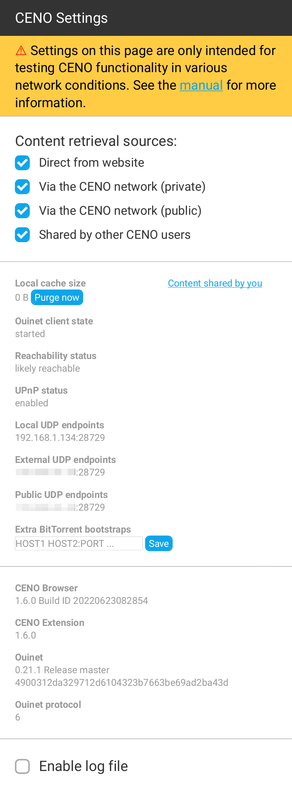
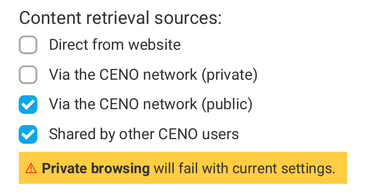

# Ceno settings

Ceno Browser allows you to change some Ouinet-specific settings and get information about your client in a simple manner.  This should not be needed for normal operation, but it would be helpful for testing different strategies against network interference, as well as reporting issues with the app.

> **Technical note:** These options are provided by the *Ceno Extension*, a Firefox extension which comes installed out of the box with Ceno and takes care of proper integration with Ouinet, like enabling content injection and cache retrieval under public browsing, hinting the user about the source of the content being visualized, and notifying about new versions of Ouinet.

These features are available on a page that can be accessed by choosing *Ceno* in the app's main menu.  Please note that the menu entry may take a few seconds to pop up on app start.  The page should look like this:

## Choosing access mechanisms

The four checkboxes on the top of the page selectively enable or disable the different mechanisms or *sources* that Ceno as a Ouinet client uses to retrieve content while using either [Public or Personal browsing](public-personal.md) tabs.  All boxes are enabled by default.

- *Direct from website* (or **origin access**) allows Ceno to try to reach the origin server directly before attempting other mechanisms enabled below.

  Although this mechanism works in both Personal and Public browsing modes, content thus retrieved cannot be shared with others.

  If getting most Web content is not particularly slow or expensive, this mechanism may be more than enough for most use cases.  However, such direct connections may be tracked by your ISP or government. To some extent, disabling this option may avoid such connections and trivial tracking (but not completely, see [risks](../concepts/risks.md)).

  Also, when accessing a Web site over insecure HTTP (instead of the more secure HTTPS), a censor may intercept the connection and supply the user with a bogus site, a tampering which Ceno cannot detect by itself.  In such cases, it may help to disable this option and thus always resort to other, safer Ceno mechanisms.  Please check the section on [troubleshooting](troubleshooting.md) to learn more about this issue.

- *Via the Ceno network (private)* (or **proxy access**) allows Ceno to use injectors as normal HTTP proxy servers to reach origin servers.

  This mechanism only works in Personal browsing mode.

  When accessing content over HTTPS, only origin servers will be able to decrypt traffic.  When using plain HTTP, the injector may also see the unencrypted traffic (but it should still not sign or share its content with others).  Other participants, such as bridges, will never see the unencrypted traffic.

- *Via the Ceno network (public)* (or **injector access**) enables Ceno to strip any private information from requests and send them to an injector.  The injector gets the content from an origin server, signs it, and sends it back to Ceno - which then begins seeding it.

  Other participants (such as bridges) will not see the unencrypted traffic.

  This mechanism only works in public browsing mode.

- *Shared by other Ceno users* allows Ceno to try to retrieve content from the **distributed cache**, i.e. from other Ceno and Ouinet clients seeding it.

  This mechanism only works in public browsing mode.

Disabling all of the mechanisms available for either Public or Personal browsing mode will render them useless.  If you establish such a configuration, a warning will be shown as depicted below:

## About your app

This page also provides you with some information about your Ceno Browser app and Ouinet client:

- *Local cache size* shows an approximation of how much storage is taken by the content being seeded from your device's local cache.
- *Content shared by you* allows you to check the content being announced by your device.
- *Ouinet client state*, if `started`, means that your Ouinet client was able to run successfully.  Otherwise, there may be connectivity issues or some internal error.  Please include this information in your issue reports.
- *Reachability status* indicates how likely it is for your device to be able to effectively seed content to other clients.  Also include in reports.
- *UPnP status* indicates whether Ceno was able to tell your router or access point to allow incoming connections towards it.  Also include in reports.
- *Local UDP endpoints* are the Internet addresses in your device used by Ceno to seed signed content to other clients.  These are shown to help test and debug the app, and should not be generally disclosed.
- *External UDP endpoints* are the Internet addresses in your router given to your Ceno traffic.  Only available with UPnP-enabled routers, they are also useful for diagnostics and not to be generally disclosed.
- *Public UDP endpoints* are the Internet addresses that Ouinet clients outside of your network see when communicating with your device.  Also for diagnostics and not to be disclosed.
- *Extra BitTorrent bootstraps* are servers used to help your device get into the BitTorrent network, should the default ones not work.  Also include in reports.  You may edit the space-separated list of hosts (with optional ports) to set or add your own, then choose *Save*.  The changes will be applied the next time that your Ouinet client is started.
- *Ceno Browser* indicates the exact version of Ceno that you are using.  Also include in reports.
- *Ceno Extension* shows the version of the extension that integrates Firefox with Ceno.  Also include in reports.
- *Ouinet* shows the version of Ouinet backing Ceno.  Also include in reports.
- *Ouinet protocol* is the version number of the protocol that Ceno uses to talk to other Ouinet clients and injectors.  Also include in reports.

## Purging the local cache

Next to the *Local cache size* value above, there is a button which allows you to stop seeding and drop all content shared by your device over Ouinet.  This allows you to free up some storage space in your device while keeping other Ceno settings like Favorites.

If you want to clear Ceno's normal browsing cache (the one used by the browser but not shared with others) or other items like cookies, browsing history or favorites, you should choose *Settings* in the app's main menu, then *Clear private data*.  You will be asked about which items you want to clear.

To drop everything at the same time (especially if you are in a hurry), please learn how to use the "panic button" feature described in [Installing Ceno](install.md).

## Collecting log messages

At the bottom of the page there is an *Enable log file* check box that allows you to collect all of Ouinet's internal messages and download them to a file.  This should only be used when diagnosing some problem in Ceno; just follow these steps:

1. At the *Ceno Settings* page, check *Enable log file*.
2. Go back to browsing and do whatever actions that trigger the troublesome behavior.
3. Return to the *Ceno Settings* page and click on the *Download* link next to the *Enable log file* check box.  Save the file for later use.  Android may ask you at this point whether to allow Ceno access to stored media: this is needed to be able to save the file.
4. Uncheck *Enable log file* to avoid the logs from growing too large.

You can now use the saved log file to document an issue report, but try to avoid making it public since it may contain sensitive information about your browsing.
