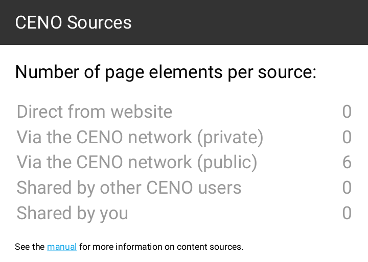

# Testing the Browser

Now that you know how to [install](install.md) and [configure](settings.md) CENO, let us follow some steps to test whether different Ouinet-specific features work.  This will involve selectively enabling and disabling different access mechanisms.  Keep in mind however that in day-to-day usage of CENO, you will seldom need to change the default settings at all.

To complete all the tests below you will need at least two devices connected to the same Wi-Fi network, and a third one on a completely different network.

All the tests will be performed using [public browsing](public-private.md).  If something does not work as expected, please be patient and check the section on [troubleshooting](troubleshooting.md).

## Accessing an injector

Let us first check whether your CENO Browser can reach an injector.  This may look trivial but your client will already be exercising several Ouinet features in the process: looking up the injector address in the injector swarm, trying to contact it directly and, if it is blocked by your access provider or country, looking up the bridge swarm and trying to contact the injector via some other Ouinet client.

In the first device perform the following steps:

 1. First of all, install CENO if needed and start it.  On the first run a series of introductory screens will appear: just click on *NEXT* until *START BROWSING* appears, then click it.  In the end, CENO's home page will appear.
 2. Open the app's main menu and choose *CENO* to open the *CENO Settings* page.  Since we only want to test injector access, uncheck all the boxes for access mechanisms except *Get content via injector*.
 3. Go back to CENO's home page.  Either select one of the recommended Web sites, or enter the URL of some other site at the address bar at the top of the window.  If you know about a site which is usually blocked for you, go ahead and enter it!
 4. The chosen site should eventually show up.

If the site does load, you can be happy that your device can reach the injector!  Since you are able to query swarms and contact other clients, you are also likely to be able to retrieve content from the distributed cache.

By the way, if you push the CENO icon in the address bar, it will open a popup like the one below, showing how many elements from the site were retrieved using each of the different access mechanisms.  Only *Via CENO network (public)* should have a non-zero value since the other mechanisms were disabled.

In contrast, if you had used private browsing with default settings, you may have seen a popup like the one below, with non-zero counts in *Direct from website* or *Via CENO network (private)*.

Finally, you may have also noticed that there is a counter for *Shared by you*.  This is not a different mechanism *per se*: elements counted here are indeed part of the distributed cache, but they happen to already be stored in your device, so CENO does not need to retrieve them over the network.

## Getting content from close users

Since your first device was able to get some content from an injector, let us test if it is able to share it with another device over the distributed cache.  The simplest way is to use CENO's device-to-device support to check whether getting and verifying signed content works.

After completing the test above on the first device, leave CENO running on it (the CENO icon should appear in its notification bar).  Then get hold of a second device (you can invite a friend over to do the test) and connect it to the same Wi-Fi network.  Then follow the steps below on that device:

 1. Install CENO if needed, start it and proceed to CENO's home page as above.
 2. Open the *CENO Settings* page as above.  Since we only want to test distributed cache access, uncheck all the boxes for access mechanisms except *Get content shared by other users*.
 3. Go back to CENO's home page and visit the same site in the same manner as you did above (i.e. by selecting one of the recommended web sites or entering its URL in the address bar).
 4. The chosen site should eventually show up.

If it works, it means that both devices are able to deliver that content to other clients.  Pushing the CENO address bar icon should show a popup like the one below, where only *Shared by other CENO users* has a non-zero value.

## Getting content from remote users

We have done a small-scale test of the distributed cache.  Let us now test how it works over the Internet.

Please leave CENO running on the first device as with the previous test, and stop CENO on the second device (by showing its notifications and pushing "Tap to stop").  This time you will need a third device, but it must be connected to a different Wi-Fi network (maybe another friend can help from home).  The steps to follow for that device are exactly the same as those in the previous test.

If the third device can load the site used for the test, you are all set.  The first device is able to seed content to others, and it can most probably also act as a bridge.  Congratulations!
