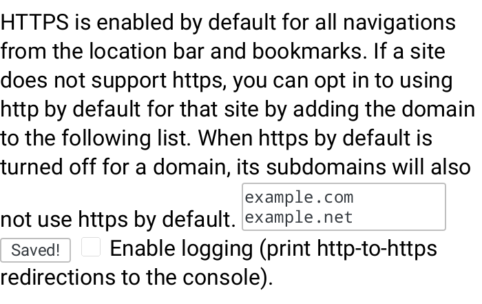

# Troubleshooting

This section will give you some hints about what to do when different, known problems arise with Ceno and Ouinet.  Please bear in mind that these are experimental projects, and that their operation is subject to a multitude of factors beyond our control, like the particular configuration and status of network infrastructure, as well as which content other users have retrieved and the characteristics of their connections.

If problems still persist, please report them to <Cenoers@equalit.ie>.  We will try to help you with them.

## There is no Ceno entry in the app menu

The Ceno Extension may still be loading.  Please be patient.

## All widgets are grayed-out in the *Ceno Settings* page

The Ceno Extension has loaded, but it has not yet been able to retrieve status from Ouinet.  Since it may take a moment for Ouinet to be ready, please be patient.

If the Settings page stays like that after more than two minutes, Ouinet may have encountered some issue while starting.

Try to visit some page, if possible one which is usually available.  If you get an error like "Failed to retrieve the resource (after attempting all configured mechanisms)", Ceno may be experiencing some issues with general connectivity (like being unable to join the BitTorrent network).  If you are on a mobile connection, try again with Wi-Fi.

If you get an error like "The proxy server is refusing connections" when visiting the page, try to stop other applications which may be offering some service to the device, then restart Ceno.

> **Technical note:** This may happen if another application is already listening on TCP ports `127.0.0.1:8077` or `127.0.0.1:8078`.

## The *Ouinet client state* under *Ceno Settings* is not `started`

The Ouinet client run by Ceno is finding problems starting on your device.

When you launch Ceno, the state may read `starting` for a few seconds; this is normal.  However, if the state remains `starting` for too long, it may be a signal of serious connectivity issues that preclude the application from reaching the BitTorrent network.  Please check your network connection and try restarting Ceno.  If you have a working connection but the state remains `starting`, please contact us (especially if the state was `started` in some previous run).

One possible reason for not being able to get into BitTorrent (more so when you run Ceno for the first time), is that the default bootstrap servers used by the Ouinet client are blocked or unreachable.  In that case you may want to try providing Ceno with extra BitTorrent bootstrap servers in the [Settings page](settings.md).  You can ask us if you do not know of any such server.  After setting the extra bootstraps, please restart the application.  If the problem persists, contact us.

If you ever see some other state, there may be some internal error in the Ouinet client.  Please report the issue to us.

## Accessing some content shows "Failed to retrieve the resource"

This means that Ceno tried all available mechanisms to access the content, but none of them succeeded.

You should make sure that the following requirements are fulfilled for Ceno to work:

- You are running a recent version of Ceno Browser.  Obsolete versions may not be able to communicate with newer injectors or other clients.  Check the [installation instructions](install.md) to know where to get new versions.
- All access mechanisms in the [Settings page](settings.md) are enabled.  Otherwise Ceno will not be able to circumvent some connectivity issues when accessing content.
- Your device has a working connection to the network, i.e. your normal Web browser is able to open some Web sites.  Ceno and Ouinet cannot work when all network connectivity is shut down (although users may still find a common Wi-Fi access point to do device-to-device sharing).

If that is the case, it is worth explaining what may be happening for all access mechanisms to fail, to give you an idea of your chances for getting content using Ceno.

### Origin access

Your Ceno Browser cannot directly reach the content's origin server.  Either the server is having some difficulties itself (e.g. it is down or under some attack), or someone is interfering with your connection to it.

This is the main use case for Ceno and the other mechanisms should compensate for it.

### Proxy/Injector access

Someone is interfering with your connection to Internet addresses in the injector swarm.  Since this is expected to happen eventually as Ceno (and Ouinet) gain traction, Ceno resorts to reaching injectors via other clients acting as bridges.

There are different reasons for Ceno being unable to reach such clients:

- No other client is reachable by you.  If only a few Ouinet clients are online, it is entirely possible that none of them are in a network that can be reached from the outside.  This should become less likely as Ceno and Ouinet get popular and more clients with diverse connectivity come online.

  The extreme case here is that connections between Ouinet clients are detected as such by a censor and blocked.  This is quite unlikely (since it may entail blocking all BitTorrent traffic) and currently beyond what Ouinet supports, but we plan to make it more resistant against these attacks.

- No other client can reach an injector.  Since it is unlikely that all injectors are simultaneously down, that may mean that you can only reach Ouinet clients which are themselves affected by similar network interference as yours.

  This can happen when all traffic leaving or entering the country you are in is interrupted.  Ceno would resort in this case to getting and using the content from the distributed cache, even if it is stale.

  Again, as Ceno and Ouinet become more popular, the chances increase that there are at least a few clients that do have some kind of access to international sites.  Even if access is precarious, a single Ouinet client able to inject some content into the country could suffice to enable it to spread (over the distributed cache) without further need to access the outside world.

Finally, we do run some Ouinet clients with good connectivity in (hopefully) censorship-free countries to try to avoid those two situations, but please note that clients with such stable Internet addresses could get blocked as well.

### Distributed cache

Keep in mind that an absolute requirement to be able to retrieve any content from the distributed cache is that it has already been injected by some other Ceno or Ouinet user.  This means that popular content is more likely to eventually get injected and replicated in a natural manner, while more obscure content is less so, unless someone takes care of using Ceno or some other Ouinet client to inject and keep seeding it (which may further expose them to some [risks](../concepts/risks.md)).

Please note that some content which is not considered safe for sharing will never be injected, no matter how many people retrieve it using public browsing.  This includes content marked as private by the origin server, content that requires authentication, and some traffic exchanged by certain dynamic Web applications.

Also note that the clients holding copies of injected content need to be reachable by you.  The same observations described in the previous point for reaching bridge clients do apply here.

### A note on HTTP-only sites

Ceno automatically switches to the more secure HTTPS protocol to access sites which would otherwise be accessed using plain, insecure HTTP.  This is done by the embedded [HTTPS by default][] extension when you enter a bare domain name like `example.com` or an HTTP URL like `http://example.com/…` in the location bar, or when you follow a link with such a URL in a page.

[HTTPS by default]: https://github.com/Rob--W/https-by-default

The automatic switching to HTTPS is done to prevent someone from intercepting an HTTP connection and directing it to an illegitimate server, resulting in bogus content (like a block message).  This kind of hijacking is trivial to detect with HTTPS, so Ceno can work around it instead of being tricked into loading the bogus content.

Although very unusual, some sites do not support HTTPS, and no access mechanism will work for them.  If you are completely sure that this is the case for a site which just failed to load in Ceno, you can edit its URL in the location bar, change `https://` to `http://`, and try again.

If you want to always access a particular site over plain HTTP, you can add a permanent exception like this:

1. In the app's main menu, choose *HTTPS by default*.  You will see that extension's settings page.
2. Enter the domain name of the site in the text box, as shown below.  See there how you may enter several sites by separating them with spaces or newlines.  Please note that entering `example.com` will also include all sites under that domain, like `www.example.com` or `x.y.example.com`.
3. When done, go back or close the tab.

**Note:** In the unfortunate case that a site is only accessible via HTTP, and it is also being hijacked by a censor, you will need to go to the [Settings page](settings.md), disable Origin access, and try again.  Please note that this setting affects all sites, and it is not remembered by Ceno for subsequent runs.  We encourage you to contact the site administrators and tell them to enable HTTPS support.

## A page shows bogus content (like a block message)

This may happen when you used an old version of Ceno to visit a blocked site in the past, and someone intercepted the connection and directed it to an illegitimate server.  Ceno then remembered that redirection, and now it automatically opens the latter site when trying to visit the former.

One way to fix this issue is to clear Ceno's normal browsing cache by choosing *Settings* in the app's main menu, then *Clear private data*, and disabling all boxes but *Cache* before tapping on *Clear data*.

Please note that Ceno version 1.3.0 and newer avoid that hijacking of newly visited sites by always using HTTPS, as explained in the previous section.

## Others cannot retrieve content seeded by my device

First, make sure that your device is still seeding the content by going to the [*Ceno Settings* page](settings.md), only leaving the *Shared by other Ceno users* source box checked, then accessing that content again: it should load (at least partially), and tapping the Ceno address bar icon should only show non-zero values under *Shared by other Ceno users* or *Shared by you*.

If the content does not load, it could be that Ceno has already removed it, since it automatically cleans up stale content (older than a week by default) from your local cache.  Enable the *Via the Ceno network (public)* source in the Settings page and access the content again.  Please allow a couple of minutes to pass for the device to announce the content in the distributed cache index.  Make *Shared by other Ceno users* the only checked box again and access the content once more; if it still does not load, it may be that the particular content is not deemed safe for sharing by Ouinet.

If the previous step works, but another device with only the *Shared by other Ceno users* source enabled still shows "Failed to retrieve the resource…", there are two possible scenarios.  If both devices are in the same network (e.g. on the same Wi-Fi access point), it could be that the network does not allow direct communication between devices connected to it.  This happens in some public Wi-Fi networks, so try using a private one.

If the devices are in different networks, it could be due to a variety of reasons.  One of them is that the network of the first device does not allow incoming connections: if you open its *Ceno Settings* page, under *Reachability status* it should say *reachable* or *likely reachable*.  Otherwise seeding may not be possible from that network as it is.

> **Technical note:** If your device reports *undecided* reachability and you can change the configuration of the access point, you may create a permanent port forwarding rule towards your client.  See [here](bridging.md) for further instructions.
