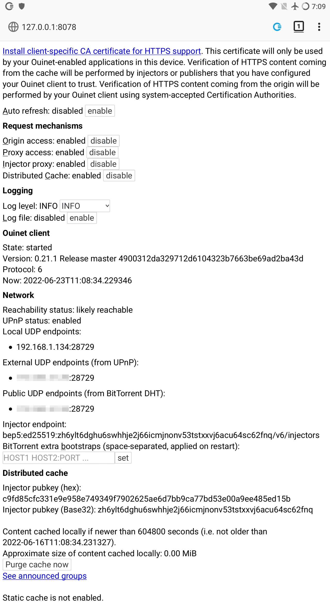

# Annex: The Ouinet client front-end

The Ouinet client (as run by e.g. CENO Browser) offers a front-end page with some information and actions which may be useful for debugging the client.  Many of them are also offered by the CENO Extension via the [*CENO Settings* page](../browser/settings.md), though others are only available here.

The front-end is accessible using any plain Web browser running on the same device (you can use CENO too).  Its default address is <http://127.0.0.1:8078/>.  If you open it, you will see something like the figure below.

The items shown in the page include:

- A link to enable the client as a certificate authority (CA) at your browser, since the client needs to intercept HTTPS traffic.

  You only need this to use a plain browser for testing the Ouinet client, in which case you will also have to configure its HTTP/HTTPS proxies to `127.0.0.1:8077`, and manually enable the [CENO Extension][] for injection to work.  We very strongly recommend using a *separate, specific browser profile* for this purpose.

  Please note that none of this needs to be done for CENO Browser, since it is already configured like that.

- Buttons to enable or disable the different mechanisms used by the client to access content.

- Selectors to choose different log levels, like the default `INFO` (informational messages, warnings and errors) or `DEBUG` (verbose output useful for reporting errors).  The log file can also be enabled and retrieved from here.

  When enabling the log file, the log level is automatically set to `DEBUG` (though you may change it again from here).  When disabling the log file, the original log level is restored.

- Global client state and version information.  Useful when reporting errors.

- Information about client connectivity and injector addressing.  The default `bep5` method looks up Internet addresses in a BitTorrent injector swarm, as explained [here](../concepts/how.md).

- The public key used to verify signatures from injectors in the distributed cache.

- Information on your local cache like the maximum content age, approximate size of the cache, a button to purge it completely, and a link to the list of announced cache entries.

- The directory of the external, static cache if enabled (CENO does not currently use this).

[CENO Extension]: https://github.com/censorship-no/ceno-ext-settings/
