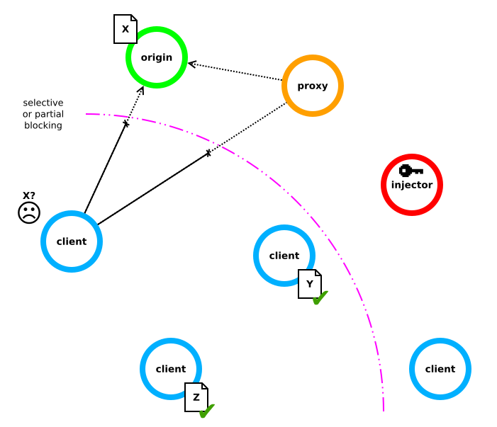
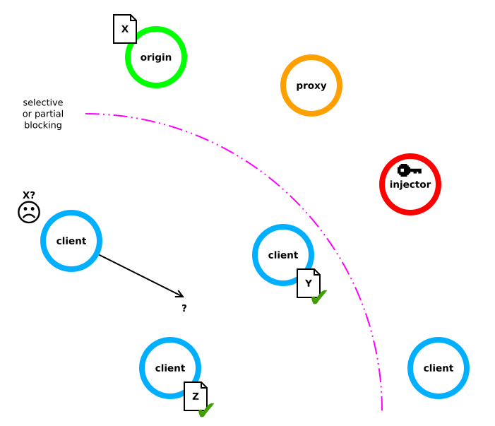
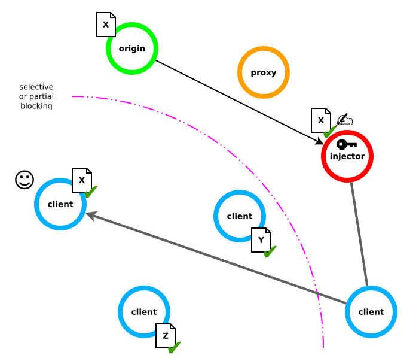
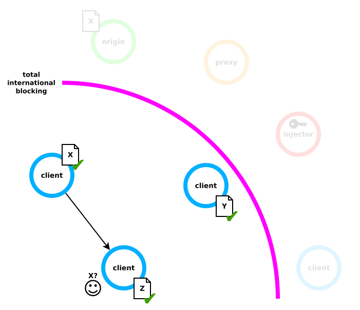
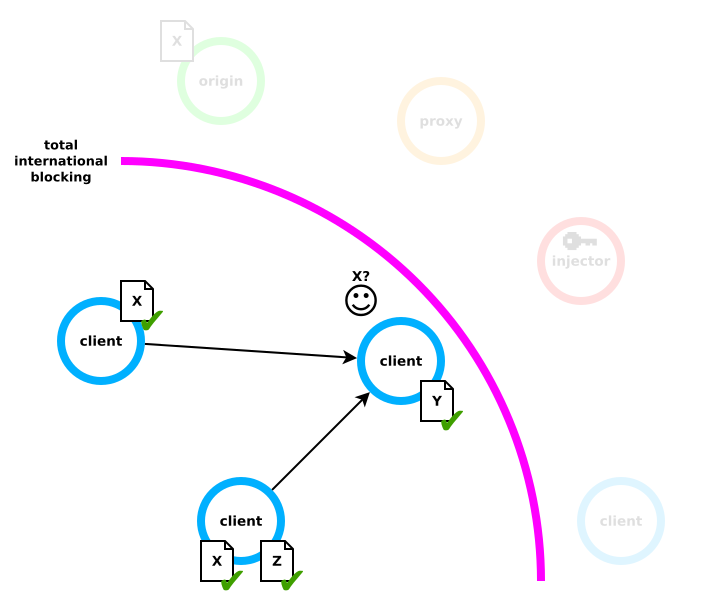

# How does it work?

This section will explain CENO and Ouinet operation by going over a series of scenarios and explaining how they behave in each of them.  Main concepts and terms used by Ouinet will be introduced (highlighted **in bold letters**) and used afterwards for efficiency and to avoid confusions.

## Accessing content directly

The CENO Browser is an example of an application which uses Ouinet technology to retrieve and share Web content.  We call such an application a Ouinet **client**.  When you use your client (i.e. CENO) to try to access some content *X*, hosted in some Web server which we call *X*'s **origin** server, your client tries to contact the origin server over the Internet either directly or via some other machine specialized in contacting Web servers on behalf of others, a so called **proxy** server, then request the desired content.  This is not different from the way in which any normal Web browser works.

> **Technical note:** There is in fact one small gotcha.  Since the client acts as an HTTP proxy running on your device, for the client to be able to decrypt and act upon HTTPS content requests, the application using it (i.e. the Web browser part) needs to accept a special certificate issued by the client itself (and only used in your device).  The CENO Browser already takes care of setting this certificate up for its private use so that you do not need to worry.

However these direct paths may not be available.  For instance, your Internet service provider (ISP) may be blocking access to *X*'s origin server or the proxy because of a state order (even if other traffic is still allowed).  As the user of the top left client depicted below, both attempts to reach content *X* (the little document close to its origin server) would fail for you.  We will come this weird "injector" node in a moment.

With a normal browser you would be out of luck.  However, with Ouinet you can ask other clients for their copies of content *X*, shall they already have one (we will see how they get these copies later on).  Let us see how Ouinet does this.

## Searching for shared content

The set of all content stored by Ouinet clients is called the **distributed cache**, i.e. a store which sits in no single place.  But how can your client find which other clients forming the cache have the desired content?

In any Web browser, to access content *X* it needs to know its [Uniform Resource Locator][] (URL), that is the address in the browser's location bar, e.g. `https://example.com/foo/x`.  From that URL, a normal browser would infer that it has to contact the server `example.com` using the HTTP protocol (the language used to exchange Web resources) over SSL/TLS (a security layer over TCP, the Internet's rules for programs to talk to each other) and request the resource `/foo/x`.

[Uniform Resource Locator]: https://en.wikipedia.org/wiki/Uniform_Resource_Locator

Ouinet looks for the content in a different way.  It uses an index not unlike that of a book: in Ouinet's **distributed cache index** you look up the whole URL of the content and get a list of clients holding a copy of it.  The index itself is distributed, with clients in charge of announcing which content they have to others.  Actually, only a *hint* on each URL is announced, so that someone spying your device's traffic cannot tell which content you have, but someone looking for a particular content can follow the hints towards your client.

> **Technical note:** One way the index is implemented is using [BitTorrent][]'s [Distributed Hash Table][] (DHT) to get the addresses (IP and port) of the clients with the content.  The DHT uses a [Cryptographic hash function][] to compute the table key from the content's URL and some other parameters as the injector key (see below), so that several indexes can coexist.
>
> Also, the CENO Browser does not announce the URL of every single resource it holds: with any modern page having tens or hundreds of components (images, style sheets, scripts…), that would cause a lot of traffic.  Instead, resources are grouped under the URL of the page pulling them, and only that URL is announced.  This is done with the help of an *ad hoc* browser extension (described later on).

[Cryptographic hash function]: https://en.wikipedia.org/wiki/Cryptographic_hash_function
[BitTorrent]: https://en.wikipedia.org/wiki/BitTorrent
[Distributed Hash Table]: https://en.wikipedia.org/wiki/Distributed_hash_table

Going back to our example scenario, there are two clients holding some content.  Unfortunately, one is holding content *Y* and the other one content *Z*, so your client would find no entries for content *X* in the distributed cache index, as depicted below.

Fortunately, Ouinet offers a way to retrieve such content and furthermore make it available to other clients on the distributed cache.  Please read on to know how.

## Sharing new content

TODO

> **Technical note:** In fact, Ouinet injectors can also operate as normal, non-caching HTTP proxies, with the added bonus that they can be reached via other Ouinet clients acting as bridges.  In this case, the injector will not see the actual information flowing between the client starting the connection and the origin server (unless it is a plain, unencrypted HTTP connection itself).  This is currently what Ouinet clients (including the CENO Browser) do when trying to access content over a proxy.

TODO

