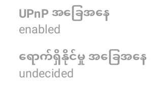
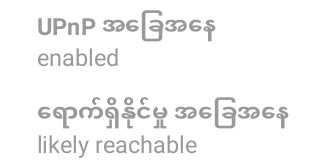

# အခြား CENO သုံးစွဲသူများအား ဝဘ်ရှာဖွေရာတွင် ကူညီခြင်း

အချင်းချင်း ချိတ်ဆက်သည့် ကွန်ရက်ကို ၎င်းနှင့် ချိတ်ဆက်ထားသည့် ဆက်သွယ်ရေးပွိုင့် တစ်ခုစီဖြင့် တည်ဆောက်ထားသည် (ဟုတ်ပါသည်၊ သင်လည်း ပါဝင်သည်ဟု ဆိုလိုပါသည်)။ ဆက်သွယ်ရေးပွိုင့်များလေလေ ကွန်ရက် ပိုမိုအားကောင်းပြီး ပိုမိုဘက်စုံအသုံးပြုနိုင်လေလေ ဖြစ်သည်။ သင်သည် အင်တာနက်ကို ဆင်ဆာမလုပ်သော (သို့မဟုတ် အချို့ကဲ့သို့ အလွန်အကျွံ ဆင်ဆာမလုပ်သော) နိုင်ငံတစ်ခုမှနေ၍ CENO ဘရောက်ဇာကို လုပ်ဆောင်နေလျှင် **ပေါင်းကူး** ဆက်သွယ်ရေးပွိုင့် ဖြစ်လာခြင်းဖြင့် အခြား CENO သုံးစွဲသူများကို ကူညီရန် စဉ်းစားပါ။ ထို့နောက် သင်သည် အလွန်အကျွံ ဆင်ဆာလုပ်ထားသော နိုင်ငံများရှိ လက်ခံစက်များနှင့် CENO ထိုးသွင်းဖိုင်များအကြား အသွားအလာကို လမ်းကြောင်းအတိုင်း စတင်ပို့ပေးပါမည်။ သင်သည် ၎င်းတို့၏ အသွားအလာကို မြင်နိုင်မည် မဟုတ်သကဲ့သို့ (၎င်းကို ကုဒ်ဖြင့် ပြောင်းလဲထားသော လိုင်းကို ဖြတ်၍ ပေးပို့ပါမည်) ဤအသွားအလာသည် သင့်စက်တွင် လုံးဝ ကျန်ခဲ့မည် မဟုတ်ပါ။

> **မှတ်ချက်-** ဤအပိုင်းတွင် ဖော်ပြထားသော စီစဉ်သတ်မှတ်မှုသည် ဖြန့်ဝေထားသည့် ယာယီသိမ်းဆည်းထားသော မှတ်ဉာဏ်တွင် သင့်စက်က အခြားစက်များထံ အကြောင်းအရာကို ထိရောက်စွာ တင်ပို့နိုင်ရန်လည်း ကူညီနိုင်သောကြောင့် ကျေးဇူးပြု၍ ဆင်ဆာလုပ်သော နိုင်ငံတွင် CENO ကို အသုံးပြုချိန်တွင်လည်း ၎င်းကို အသုံးချရန် စဉ်းစားပါ (သို့သော် ထိုအကြောင်းအရာကို အခြားစက်များအား ပေးခြင်း၏ [စွန့်စားမှုများ](../concepts/risks.md) ကို သတိထားပါ)။

## CENO ပေါင်းကူး ဖြစ်လာနည်း

ဤအသုံးချမှုကို CENO ဘရောက်ဇာထံသို့ ထည့်သွင်းတည်ဆောက်ပြီးသား ဖြစ်သည်။ သင့်စက်ကို UPnP ဖွင့်ထားသော သို့မဟုတ် CENO အတွက် သိသာသည့် ပေါ့တ် တစ်ဆင့်ပို့ခြင်းကို စီစဉ်သတ်မှတ်ထားသော Wi-Fi ကွန်ရက်သို့ ချိတ်ဆက်ထားရန် လိုအပ်ပါမည်။ နောက်ထပ် အသေးစိတ် အချက်အလက်များအတွက် လာမည့် အပိုင်းများကို ကြည့်ပါ။

သို့သော် Android သည် ၎င်းကို တက်ကြွစွာ အသုံးပြုနေချိန်တွင်သာ သင့်လျော်သော ပေါင်းကူးအဖြစ် လုပ်ဆောင်ရန် မိုဘိုင်းစက်ကို ခွင့်ပြုမည်ဖြစ်ကြောင်း ကျေးဇူးပြု၍ သတိပြုပါ။ ထိုသို့မဟုတ်ပါက ပါ‌ဝါချွေတာရေး လုပ်ဆောင်ချက်များသည် CENO ၏ လည်ပတ်မှုကို ထိခိုက်စေမည် ဖြစ်သည်။

> **နည်းပညာဆိုင်ရာ မှတ်ချက်-** ယင်းသည် အဓိကအားဖြင့် Android ၏ [ခဏအိပ်မုဒ်](https://developer.android.com/training/monitoring-device-state/doze-standby "Android ဆော့ဖ်ဝဲရေးသူများ - ခဏအိပ်နှင့် အက်ပ် အသင့်အနေအထားအတွက် အကောင်းဆုံးချိန်ညှိပါ") က မူလ Ouinet စာကြည့်တိုက်၏ လုပ်ဆောင်ချက်ကို နှေးစေသောကြောင့် ဖြစ်သည်။ ကံမကောင်းစွာဖြင့် CENO အတွက် ဘက်ထရီ အကောင်းဆုံးချိန်ညှိမှုကို ပိတ်ခြင်းက Ouinet ကို ၎င်းမှ ဖယ်လိုက်သည့်ပုံ မပေါ်ပါ။ သင်၏ တိကျသော စက်တွင်လည်း Ouinet ကို ကြားဝင်နှောင့်ယှက်နိုင်သည့် ၎င်း၏ ကိုယ်ပိုင် ပါဝါချွေတာရေး လုပ်ဆောင်ချက်များ ပါဝင်နိုင်သည်။ ကျေးဇူးပြု၍ သင့်စက်၏ တံဆိပ်အတွက် [Dont't kill my app!](https://dontkillmyapp.com/) ကို စစ်ဆေးပါ။

ထို့ကြောင့် သင်သည် CENO ကို အဆုံးတိုင် အမြဲရောက်ရှိနိုင်သော ပေါင်းကူးအဖြစ် လုပ်ဆောင်ရန် ရည်ရွယ်ပါက မှန်ကန်စွာ စီစဉ်သတ်မှတ်ထားသော Wi-Fi ကွန်ရက်အပြင် သင်သည် အောက်ပါတို့ကို လိုအပ်ပါမည်-

1. သင့်စက်ကို အချိန်ပြည့် အားသွင်းထားရန်။

   1. စက်၏ မျက်နှာပြင်ကို အချိန်ပြည့် ဖွင့်ထားရန်။ဤသို့ပြုလုပ်ရာတွင် ပါဝါသုံးစွဲမှုများခြင်းနှင့် မလိုလားအပ်သော အမြဲတမ်း မီးလင်းနေခြင်း မရှိမည့် အဆင်ပြေသည့် နည်းလမ်းတစ်ခုမှာ Android ၏ မျက်နှာပြင် ရုပ်ပုံပြောင်းလဲပြသမှုကို အသုံးပြုခြင်း ဖြစ်သည်- ၎င်းကို *ဆက်တင်များ / ပြသမှု / မျက်နှာပြင် ရုပ်ပုံပြောင်းလဲပြသမှု* (သို့မဟုတ် အချို့ဗားရှင်းများတွင် *စိတ်ကူးယဉ်မှု*) အောက်တွင် ဖွင့်ပါ၊ *နာရီ* ဝစ်ဂျစ်ကို ရွေးချယ်ပါ၊ မီနူးရှိ *မျက်နှာပြင် ရုပ်ပုံပြောင်းလဲပြသမှု စတင်ချိန်* ကို ရွေးချယ်ပြီး *အားသွင်းစဉ်* သို့မဟုတ် *နှစ်ခုမှတစ်ခု* ကို ရွေးချယ်ပါ။ စက်ကို အသုံးပြုမနေသည့်အချိန်တွင် အနက်ရောင် နောက်ခံ၌ အလွန်အရောင်မှိန်သော နာရီ ပေါ်လာပါမည်။

   စက်ကို လော့ခ်ချရန် ပါဝါခလုတ်ကို အသုံးပြုခြင်းသည် မျက်နှာပြင်ကို ပိတ်စေမည်ဖြစ်သောကြောင့် ယင်းသို့ မပြုလုပ်သင့်ကြောင်း သတိပြုပါ။ ထိုအစား မျက်နှာပြင် ဖွင့်ထားလျက်နှင့် စက်ကို ၎င်းကိုယ်တိုင် လော့ခ်ချရန်သာ စောင့်ဆိုင်းပါ။

## သင့် Wi-Fi ‌ရောက်တာတွင် UPnP ကို ဖွင့်ခြင်း

[UPnP](https://en.wikipedia.org/wiki/Universal_Plug_and_Play) သည် သင့် CENO ဘရောက်ဇာကို CENO ကွန်ရက်သို့ ရောက်ရှိစေရန်အတွက် အလွယ်ဆုံး နည်းလမ်းဖြစ်သည်။ [CENO ဆက်တင်များ](settings.md) စာမျက်နှာသည် သင့်ဒေသတွင်း ကွန်ရက်တွင် UPnP အခြေအနေကို ဖော်ပြပါမည်။

> **မှတ်ချက်-** Wi-Fi ရောက်တာတွင် UPnP ကို ဖွင့်ခြင်းက သင့်ကွန်ရက်ရှိ စက်များကို ပြင်ပ ကြားဝင်နှောင့်ယှက်မှု ကြုံရစေနိုင်သည်။ ကျေးဇူးပြု၍ သင်ကိုယ်တိုင် [စွန့်စားမှုများကို သတိထားပါ](https://www.howtogeek.com/122487/htg-explains-is-upnp-a-security-risk)၊ ထို့ပြင် အောက်တွင် ရှင်းပြထားသော အခြားနည်းလမ်းများကို အသုံးပြုရန်လည်း စဉ်းစားပါ။

ယခင်ပုံတွင် ပြထားသကဲ့သို့ အခြေအနေသည် သင့် WiFi ရောက်တာတွင် UPnP ကို ဖွင့်မထားကြောင်း ညွှန်ပြသည်။

အထက်ပါအခြေအနေသည် UPnP အလုပ်လုပ်နိုင်ခြေရှိပြီး CENO က လက်ရှိတွင် ချိတ်ဆက်နိုင်မှုကို မှန်ကန်ကြောင်း စစ်ဆေးနေသည်ဟု ညွှန်ပြသည်။

အထက်ပါ အခြေအနေသည် UPnP အလုပ်လုပ်နေပြီး သင်သည် အခြား CENO သုံးစွဲသူများအတွက် ချိတ်ဆက်မှုများကို ပေါင်းကူးနိုင်ကြောင်း ညွှန်ပြသည်။

ဈေးကွက်တွင် Wi-Fi ရောက်တာများစွာ ရှိပြီး တစ်ခုစီတွင် ၎င်းတို့၏ ကိုယ်ပိုင်တိကျသော လုပ်ဆောင်ချက်များ ရှိသည်။ ဤသည်တို့မှာ-UPnP ဖွင့်ရန်အတွက် ထုတ်လုပ်သူအချို့၏ လမ်းညွှန်ချက် စာရင်း ဖြစ်သည်-

* [Linksys](https://www.linksys.com/us/support-article?articleNum=138290)
* [D-Link](https://eu.dlink.com/uk/en/support/faq/routers/wired-routers/di-series/how-do-i-enable-upnp-on-my-router)
* [Huawei](https://consumer.huawei.com/ph/support/content/en-us00275342/)
* [Xfinity](https://www.xfinity.com/support/articles/configure-device-discovery-for-wifi)
* [TP-Link](https://community.tp-link.com/us/home/kb/detail/348)

## UPnP အစား ပေါ့တ် တစ်ဆင့်ပို့ခြင်းကို အသုံးပြုခြင်း

သင့်ရောက်တာတွင် UPnP ကို ဖွင့်မည့်အစား သင်သည် CENO ကွန်ရက်မှ ချိတ်ဆက်မှုများကို သင့်စက်သို့ တစ်ဆင့်ပို့ကြောင်း သေချာစေရန် ပေါ့တ်တစ်ဆင့်ပို့ခြင်း စည်းကမ်းတစ်ခုကို သတ်မှတ်နိုင်သည်။ သင်သည် ရောက်တာ၏ စီမံခန့်ခွဲမှု ကြားခံစနစ်သို့ ဝင်ရောက်ပြီး *ပေါ့တ်တစ်ဆင့်ပို့ခြင်း* ရွေးချယ်စရာကို ရှာဖွေရန် လိုအပ်ပါမည်။ သင် ချိတ်ဆက်မှုများ တစ်ဆင့်ပို့ရန် လိုအပ်သည့် IP လိပ်စာကို ကြည့်ရန် *CENO ဆက်တင်များ* စာမျက်နှာကို ဖွင့်ပြီး *ဒေသတွင်း UDP အဆုံးမှတ်(များ)* အောက်တွင် ကြည့်ပါ။

ပေါ့တ်တစ်ဆင့်ပို့ခြင်းသည် UDP ပရိုတိုကောအတွက် ဖြစ်ရမည် (TCP မဖြစ်ရပါ)။ CENO သည် ပထမအကြိမ် လုပ်ဆောင်ချိန်တွင် အလျဉ်းသင့်သော ပေါ့တ်တစ်ခုကို ရွေးချယ်ပြီး နောင်လာမည့်လုပ်ဆောင်ချက်များအတွက် ၎င်းကို သိမ်းထားသော်လည်း သင့်စက်၏ ဒေသတွင်း ကွန်ရက် IP လိပ်စာသည် မကြာခဏ ပြောင်းလဲနိုင်သည်။ ထို့ကြောင့် သင်သည် CENO ကွန်ရက်က သင့်စက်ထံ ရောက်ရှိနိုင်ကြောင်း ကြည့်ရန် *CENO ဆက်တင်များ* စာမျက်နှာကို ပုံမှန် စစ်ဆေးသင့်သည်။

> **နည်းပညာဆိင်ရာ မှတ်ချက်-** တစ်နည်းအားဖြင့် သင်သည် ရောက်တာက သင့်စက်ကို တူညီသော IP လိပ်စာ အမြဲသတ်မှတ်ပေးရန် (ဥပမာ- စက်၏ MAC လိပ်စာအတွက် တည်တံ့သော DHCP အငှားမှတစ်ဆင့်) သေချာအောင်ပြုလုပ်နိုင်သည်။

[Doze mode]: https://developer.android.com/training/monitoring-device-state/doze-standby
[Dont't kill my app!]: https://dontkillmyapp.com/
[UPnP]: https://en.wikipedia.org/wiki/Universal_Plug_and_Play
[upnp-risks]: https://www.howtogeek.com/122487/htg-explains-is-upnp-a-security-risk
