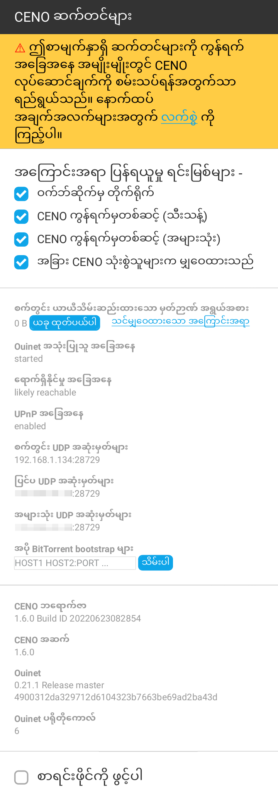
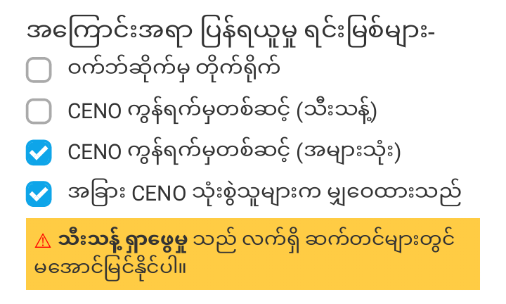

# CENO ဆက်တင်များ

CENO ဘရောက်ဇာသည် သင့်အား Ouinet သီးသန့် ဆက်တင်အချို့ကို ပြောင်းလဲပြီး ရိုးရှင်းသော နည်းလမ်းဖြင့် သင့်လက်ခံစက်အကြောင်း အချက်အလက် ရယူခွင့်ပြုသည်။ ယင်းကို ပုံမှန်လည်ပတ်မှုအတွက် မလိုအပ်နိုင်သော်လည်း ကွန်ရက် ကြားဝင်နှောင့်ယှက်မှုကို တိုက်ဖျက်ရန် မတူညီသော မဟာဗျူဟာများကို စမ်းသပ်ရာတွင် ကူညီရန်နှင့် အက်ပ်နှင့် သက်ဆိုင်သော ပြဿနာများကို အစီရင်ခံရန် အသုံးဝင်နိုင်သည်။

> **နည်းပညာဆိုင်ရာ မှတ်ချက်-** ဤရွေးချယ်စရာများကို *CENO အဆက်* က ပံ့ပိုးသည်။ ၎င်းသည်

ဤလုပ်ဆောင်ချက်များကို အက်ပ်၏ အဓိက မီနူးရှိ *CENO* ကို ရွေးချယ်ခြင်းဖြင့် ဝင်ရောက်သုံးစွဲနိုင်သော စာမျက်နှာတွင် ရရှိနိုင်သည်။ အက်ပ် စတင်ချိန်တွင် မီနူးအကြောင်းအရာ ပေါ်လာရန် စက္ကန့်အနည်းငယ် ကြာနိုင်ကြောင်း ကျေးဇူးပြု၍ သတိပြုပါ။ စာမျက်နှာကို ဤသို့ တွေ့ရနိုင်သည်-

**

## ဝင်ရောက်သုံးစွဲမှု စက်ကိရိယာကို ရွေးချယ်ခြင်း

စာမျက်နှာထိပ်ဘက်ရှိ အမှန်ခြစ်ရန် အကွက် လေးခုသည် [အများသုံး သို့မဟုတ် သီးသန့် ရှာဖွေခြင်း](public-private.md) တက်ဘ်များမှ တစ်ခုခုကို အသုံးပြုနေစဉ် အကြောင်းအရာကို ပြန်ထုတ်ရန် Ouinet လက်ခံစက်အနေနှင့် CENO က အသုံးပြုသော ကွဲပြားသည့် စက်ကိရိယာ သို့မဟုတ် *ရင်းမြစ်များ* ကို ရွေးချယ်၍ ဖွင့်သည် သို့မဟုတ် ပိတ်သည်။ ပုံသေအားဖြင့် အကွက်အားလုံးကို ဖွင့်ထားသည်။

   - *ဝက်ဘ်ဆိုက်မှ တိုက်ရိုက်* (သို့မဟုတ် **မူလ ဝင်ရောက်သုံးစွဲမှု**) သည် အောက်တွင် ဖွင့်ထားသော အခြားစက်ကိရိယာများကို မကြိုးစားခင် CENO အား မူလဆာဗာထံ တိုက်ရိုက်ရောက်အောင် ကြိုးစားခွင့်ပြုသည်။ဤစက်ကိရိယာသည် သီးသန့်နှင့် အများသုံး ရှာဖွေခြင်းမုဒ် နှစ်ခုလုံးအတွက် အလုပ်လုပ်သည့်တိုင်အောင် ထိုသို့ ပြန်ထုတ်ထားသော အကြောင်းအရာကို အခြားသူများနှင့် မမျှဝေနိုင်ပါ။

ဝက်ဘ်အကြောင်းအရာအများစုကို ရယူရန် ပြောပလောက်အောင် မနှေးပါက သို့မဟုတ် ဈေးမကြီးပါက ဤစက်ကိရိယာသည် ကိစ္စရပ် အများစုအတွက် လုံလောက်နိုင်သည်။ သို့သော် ထိုတိုက်ရိုက် ချိတ်ဆက်မှုများကို သင်၏ ISP သို့မဟုတ် အစိုးရက ခြေရာခံနိုင်သည်။ ဤရွေးချယ်စရာကို ပိတ်ခြင်းက ထိုချိတ်ဆက်မှုများနှင့် မပြောပလောက်သော ခြေရာခံခြင်းကို အတိုင်းအတာတစ်ခုအထိ ရှောင်ရှားနိုင်သည်။ (သို့သော် အပြည့်အဝ မဟုတ်ပါ၊ [စွန့်စားမှုများ](../concepts/risks.md) ကို ကြည့်ပါ)။

   Also, when accessing a Web site over insecure HTTP (instead of the more secure HTTPS), a censor may intercept the connection and supply the user with a bogus site, a tampering which CENO cannot detect by itself. In such cases, it may help to disable this option and thus always resort to other, safer CENO mechanisms.

   - *CENO ကွန်ရက် (သီးသန့်) မှတစ်ဆင့်* (သို့မဟုတ် **ပရောက်စီ ဝင်ရောက်သုံးစွဲခွင့်**) သည် မူလ ဆာဗာများသို့ ရောက်ရှိရန် CENO အား ထိုးသွင်းဖိုင်များကို ပုံမှန် HTTP ပရောက်စီ ဆာဗာများအဖြစ် အသုံးပြုခွင့်ပေးသည်။ဤစက်ကိရိယာသည် သီးသန့် ရှာဖွေမှုမုဒ်တွင်သာ အလုပ်လုပ်သည်။

   When accessing content over HTTPS, only origin servers will be able to decrypt traffic. When using plain HTTP, the injector may also see the unencrypted traffic (but it should still not sign or share its content with others). Other participants, such as bridges, will never see the unencrypted traffic.

   - *CENO ကွန်ရက် (သီးသန့်) မှတစ်ဆင့်* (သို့မဟုတ် **ပရောက်စီ ဝင်ရောက်သုံးစွဲခွင့်**) သည် မူလ ဆာဗာများသို့ ရောက်ရှိရန် CENO အား ထိုးသွင်းဖိုင်များကို ပုံမှန် HTTP ပရောက်စီ ဆာဗာများအဖြစ် အသုံးပြုခွင့်ပေးသည်။

   ဤစက်ကိရိယာသည် သီးသန့် ရှာဖွေမှုမုဒ်တွင်သာ အလုပ်လုပ်သည်။

   - *အခြား CENO သုံးစွဲသူများက မျှဝေထားသည်* သည် CENO အား အကြောင်းအရာကို **ဖြန့်ချိထားသော ယာယီသိမ်းဆည်းထားသည့် မှတ်ဉာဏ်** မှ ပြန်ထုတ်ရန် ကြိုးစားခွင့်ပြုသည်။ ဆိုလိုသည်မှာ ၎င်းကို တင်ပို့သော အခြား CENO နှင့် Ouinet လက်ခံစက်များထံမှ ဖြစ်သည်။ဤစက်ကိရိယာသည် သီးသန့် ရှာဖွေမှုမုဒ်တွင်သာ အလုပ်လုပ်သည်။

အများသုံး သို့မဟုတ် သီးသန့် ရှာဖွေမှုမုဒ်အတွက် ရရှိနိုင်သော စက်ကိရိယာအားလုံးကို ပိတ်ခြင်းသည် ၎င်းတို့ကို အသုံးမဝင် ဖြစ်စေလိမ့်မည်။ သင်သည် ထိုစီစဉ်သတ်မှတ်မှုကို တည်ဆောက်ပါက အောက်တွင် ဖော်ပြထားသည့်အတိုင်း သတိပေးချက်ကို ပြသပါမည်။

> **သတိပေးချက်-** အက်ပ်ကို ပြန်လည်စတင်ပြီးနောက် CENO သည် ဤဆက်တင်များကို မမှတ်မိနိုင်သေးကြောင်း ကျေးဇူးပြု၍ သတိပြုပါ။ သင်သည် CENO ကို အသုံးပြုနေစဉ် ယခင် စက်ကိရိယာအချို့ကို ပိတ်ထားရန် လိုအပ်ပါက သင် အက်ပ်ကို စတင်သည့်အချိန်တိုင်း ဆက်တင်များ စာမျက်နှာကို ဖွင့်ရန်နှင့် မရှာဖွေမီ ၎င်းတို့၏ အကွက်များကို အမှန်ခြစ်ဖြုတ်ရန် ကျေးဇူးပြု၍ သတိရပါ။ အဆင်မပြေမှုအတွက် တောင်းပန်ပါသည်။

## သင်၏ အက်ပ်အကြောင်း

ဤစာမျက်နှာသည် သင့် CENO ဘရောက်ဇာ အက်ပ်နှင့် Ouinet လက်ခံစက်အကြောင်း အချက်အလက်အချို့ကိုလည်း သင့်အား ပေးသည်-

- *CENO ဘရောက်ဇာ* သည် သင်အသုံးပြုနေသော CENO ဗားရှင်း အတိအကျကို ညွှန်ပြသည်။ ကျေးဇူးပြု၍ ဤအချက်အလက်ကို သင်၏ ပြဿနာ အစီရင်ခံစာများတွင် ထည့်ပါ။
- *CENO အဆက်* သည် Firefox ကို CENO နှင့် ပေါင်းစည်းပေးသော အဆက်၏ ဗားရှင်းကို ပြသသည်။ အစီရင်ခံစာများတွင်လည်း ထည့်ပါ။
- *Ouinet* သည် CENO ကို ထောက်ခံသော Ouinet ၏ ဗားရှင်းကို ပြသသည်။ အစီရင်ခံစာများတွင်လည်း ထည့်ပါ။
- *Ouinet ပရိုတိုကော* သည် CENO က အခြား Ouinet လက်ခံစက်များနှင့် ထိုးသွင်းဖိုင်များနှင့် ဆက်သွယ်ရန် အသုံးပြုသော ပရိုတိုကော၏ ဗားရှင်းနံပါတ် ဖြစ်သည်။ အစီရင်ခံစာများတွင်လည်း ထည့်ပါ။
- *စက်တွင်း UDP အဆုံးမှတ်(များ)* သည် CENO က အခြားလက်ခံစက်များထံ လက်မှတ်ထိုးထားသော အကြောင်းအရာကို တင်ပို့ရန် အသုံးပြုသော အင်တာနက် လိပ်စာများ ဖြစ်သည်။ အက်ပ်ကို ကူညီစမ်းသပ်ရန်နှင့် ချွတ်ယွင်းချက် ပြုပြင်ရန်အတွက် ၎င်းတို့ကို ပြသထားပြီး ယေဘုယျအားဖြင့် မထုတ်ဖော်သင့်ပါ။
- *UPnP အခြေအနေ* သည် CENO က သင့်ရောက်တာ သို့မဟုတ် ဝင်ရောက်သုံးစွဲမှု ပွိုင့်အား ၎င်းထံလာသည့် အဝင်ချိတ်ဆက်မှုများကို ခွင့်ပြုရန် ပြောနိုင်ခဲ့ခြင်း ရှိ၊ မရှိကို ညွှန်ပြသည်။ အစီရင်ခံစာများတွင်လည်း ထည့်ပါ။
- *ရောက်ရှိနိုင်မှု အခြေအနေ* သည် သင့်စက်က အခြားလက်ခံစက်များထံ အကြောင်းအရာကို ထိရောက်စွာ တင်ပို့ရန် မည်မျှဖြစ်နိုင်ခြေရှိကြောင်း ညွှန်ပြသည်။ အစီရင်ခံစာများတွင်လည်း ထည့်ပါ။
- *စက်တွင်း ယာယီသိမ်းဆည်းထားသော မှတ်ဉာဏ် အရွယ်အစား* သည် သင့်စက်၏ စက်တွင်း ယာယီသိမ်းဆည်းထားသော မှတ်ဉာဏ်မှ တင်ပို့နေသော အကြောင်းအရာက သိုလှောင်မှုမည်မျှကို နေရာယူကြောင်း မှန်းခြေကို ပြသသည်။

## စက်တွင်း ယာယီသိမ်းဆည်းထားသော မှတ်ဉာဏ်ကို ထုတ်ပယ်ခြင်း

အထက်ပါ *စက်တွင်း ယာယီသိမ်းဆည်းထားသော မှတ်ဉာဏ် အရွယ်အစား* တန်ဖိုး၏ ဘေးတွင် သင့်စက်က Ouinet သုံး၍ မျှဝေထားသော အကြောင်းအရာအားလုံးကို တင်ပို့ခြင်း ရပ်ပြီး လွှတ်ချရန် ခွင့်ပြုသော ခလုတ်တစ်ခု ရှိသည်။ ယင်းသည် အနှစ်သက်ဆုံးများကဲ့သို့ အခြား CENO ဆက်တင်များကို ထိန်းသိမ်းထားစဉ် သင့်အား သင့်စက်၏ သိုလှောင်ခန်းနေရာ အချို့ကို ရှင်းလင်းခွင့်ပြုသည်။

သင်သည် CENO ၏ ပုံမှန် ရှာဖွေခြင်းဆိုင်ရာ ယာယီသိမ်းဆည်းထားသော မှတ်ဉာဏ် (ဘရောက်ဇာက အသုံးပြုသော်လည်း အများနှင့်မမျှဝေထားသော မှတ်ဉာဏ်) သို့မဟုတ် ကွတ်ကီးများ၊ ရှာဖွေမှုမှတ်တမ်း သို့မဟုတ် အနှစ်သက်ဆုံးများကဲ့သို့ အခြားအရာဝတ္ထုများကို ရှင်းလင်းလိုပါက သင်သည် အက်ပ်၏ အဓိက မီနူးရှိ *ဆက်တင်များ* ကို ရွေးချယ်ပြီးနောက် *သီးသန့်ဒေတာကို ရှင်းလင်းရန်* ကို ရွေးချယ်သင့်သည်။ မည်သည့် အရာဝတ္ထုများကို သင်ရှင်းလင်းလိုကြောင်း သင့်အား မေးပါမည်။

(အထူးသဖြင့် သင် အလျင်လိုနေပါက) အရာအားလုံးကို တစ်ချိန်တည်းတွင် လွှတ်ချရန် ကျေးဇူးပြု၍ [CENO ထည့်သွင်းခြင်း](install.md) တွင် ဖော်ပြထားသော "စိုးရိမ်မှုခလုတ်" လုပ်ဆောင်ချက်ကို အသုံးပြုပုံ လေ့လာပါ။

## စာရင်း မက်ဆေ့ချ်များကို စုဆောင်းခြင်း

စာမျက်နှာ၏ အောက်ခြေတွင် သင့်အား Ouinet ၏ စက်တွင်း မက်ဆေ့ချ်အားလုံးကို စုဆောင်းပြီး ၎င်းတို့ကို ဖိုင်တစ်ခုထဲသို့ ဒေါင်းလုဒ်လုပ်ခွင့်ပြုသည့် *စာရင်းဖိုင် ဖွင့်မည်* အကွက်တစ်ခု ရှိသည်။ ယင်းကို CENO တွင် ပြဿနာတစ်ခုခုကို အမျိုးအမည်သတ်မှတ်သည့် အချိန်တွင်သာ အသုံးပြုသင့်သည်။ အောက်ပါ အဆင့်များကိုသာ လိုက်နာပါ-

1. *CENO ဆက်တင်များ* စာမျက်နှာတွင် *စာရင်းဖိုင် ဖွင့်မည်* ကို အမှန်ခြစ်ပါ။
1. ရှာဖွေမှုသို့ ပြန်သွားပြီး ပြဿနာဖြစ်စေသော အပြုအမူကို လှုံ့ဆော်သည့် မည်သည့်လုပ်ဆောင်ချက်များကိုမဆို ပြုလုပ်ပါ။
1. *CENO ဆက်တင်များ* စာမျက်နှာသို့ ပြန်သွားပြီး *စာရင်းဖိုင်ဖွင့်မည်* အကွက်ဘေးရှိ *ဒေါင်းလုဒ်လုပ်ရန်* လင့်ကို နှိပ်ပါ။ နောက်ပိုင်းတွင် အသုံးပြုရန်အတွက် ဖိုင်ကို သိမ်းဆည်းပါ။ ဤနေရာတွင် Android သည် သိုလှောင်ထားသော မီဒီယာသို့ CENO အား ဝင်ရောက်သုံးစွဲခွင့် ပြု၊ မပြုကိုသင့်အား မေးနိုင်သည်- ဖိုင်ကို သိမ်းဆည်းနိုင်ရန် ၎င်းကို လိုအပ်ပါသည်။
1. စာရင်းများ အလွန်အကျွံ ကြီးမားလာခြင်းကို ရှောင်ရှားရန် *စာရင်းဖိုင်ကို ဖွင့်မည်* ကို အမှန်ခြစ်ဖြုတ်ပါ။

ယခု သင်သည် ပြဿနာ အစီရင်ခံစာတစ်ခုကို မှတ်တမ်းတင်ရန် သိမ်းဆည်းထားသော စာရင်းဖိုင်ကို အသုံးပြုနိုင်သော်လည်း ၎င်းတွင် သင်၏ ရှာဖွေမှုအကြောင်း ထိလွယ်ရှလွယ်သော အချက်အလက် ပါဝင်နိုင်သောကြောင့် ၎င်းကို အများသိအောင် ပြုလုပ်ခြင်းကို ကြိုးစားရှောင်ရှားပါ။
