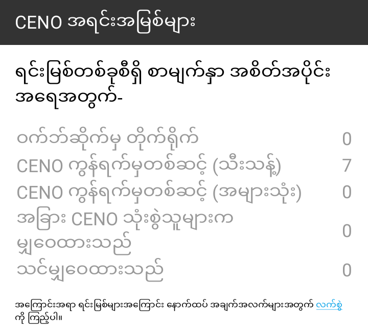

# ဘရောက်ဇာ စမ်းသပ်ခြင်း

ယခု သင်သည် CENO ကို မည်သို့ [ထည့်သွင်း](install.md) ပြီး[စီစဉ်သတ်မှတ်](settings.md) ရမည်ကို သိပြီဖြစ်သောကြောင့် ကွဲပြားသော Ouinet သီးသန့် လုပ်ဆောင်ချက်များ အလုပ်လုပ်၊ မလုပ် စမ်းသပ်ရန် အဆင့်အချို့ကို လုပ်ဆောင်ကြည့်ရအောင်။ ယင်းတွင် ကွဲပြားသော ဝင်ရောက်သုံးစွဲခွင့် စက်ကိရိယာများကို ရွေးချယ်၍ ဖွင့်ခြင်းနှင့် ပိတ်ခြင်း ပါဝင်ပါမည်။ သို့သော် CENO ကို နေ့စဉ် အသုံးပြုရာတွင် သင်သည် ပုံသေ ဆက်တင်များကို ပြောင်းလဲရန် လိုအပ်ခဲမည် ဖြစ်ကြောင်း သိမှတ်ထားပါ။

အောက်ပါ စမ်းသပ်မှုအားလုံးကို ပြီးမြောက်ရန် သင်သည် Wi-Fi ကွန်ရက် တစ်ခုတည်းသို့ ချိတ်ဆက်ထားသော စက် အနည်းဆုံး နှစ်လုံး လိုအပ်မည်ဖြစ်ပြီး တတိယစက်ကို လုံးဝ ကွဲပြားသော ကွန်ရက်သို့ ချိတ်ဆက်ထားရမည်။

စမ်းသပ်မှုအားလုံးကို [အများသုံး ရှာဖွေမှု](public-private.md) အသုံးပြု၍ လုပ်ဆောင်ပါမည်။ တစ်စုံတစ်ရာ မျှော်လင့်ထားသည့်အတိုင်း ဖြစ်မလာပါက ကျေးဇူးပြု၍ စိတ်ရှည်ပြီး [ပြဿနာဖြေရှင်းခြင်း](troubleshooting.md) ရှိ အပိုင်းကို စစ်ဆေးပါ။ တိတိကျကျ ဆိုရလျှင် စာမျက်နှာ တင်နေစဉ် ဘရောက်ဇာသည် နှစ်မိနစ်ထက်ပို၍ ကပ်နေလျှင် သင်သည် ရပ်တန့်ရန် နှိပ်ပြီး ၎င်းကို ပြန်တင်နိုင်ပါသည် (သို့သော် ယင်းသည် ရလဒ်များကို အနည်းငယ် ပြောင်းလဲနိုင်သည်)။

## ထိုးသွင်းဖိုင် ဝင်ရောက်သုံးစွဲခြင်း

ပထမဦးစွာ သင့် CENO ဘရောက်ဇာသည် ထိုးသွင်းဖိုင်ကို ရောက်နိုင်ခြင်း ရှိ၊ မရှိ စစ်ဆေးကြည့်ရအောင်။ ယင်းသည် မပြောပလောက်ဟု ထင်ရသော်လည်း သင့်လက်ခံစက်သည် လုပ်ငန်းစဉ်တွင် Ouinet လုပ်ဆောင်ချက် အနည်းငယ်ကို ကျင့်သုံးပြီး ဖြစ်နေပါမည်- ထိုးသွင်းဖိုင် အုပ်စုတွင် ထိုးသွင်းဖိုင် လိပ်စာကို ရှာကြည့်ခြင်း၊ ၎င်းကို တိုက်ရိုက် ဆက်သွယ်ရန် ကြိုးစားခြင်းနှင့် ၎င်းကို သင်၏ ဝင်ရောက်သုံးစွဲခွင့်ပေးသူ သို့မဟုတ် နိုင်ငံက ပိတ်ဆို့ထားပါက ပေါင်းကူး အုပ်စုတွင် ရှာကြည့်ပြီး ထိုးသွင်းဖိုင်ကို အခြား Ouinet လက်ခံစက်တစ်ခုခုမှတစ်ဆင့် ဆက်သွယ်ရန် ကြိုးစားခြင်း။

ပထမစက်တွင် အောက်ပါ အဆင့်များကို လုပ်ဆောင်ပါ-

1. ပထမဦးစွာ လိုအပ်ပါက CENO ကို ထည့်သွင်းပြီး စတင်ပါ။ ပထမအကြိမ် လုပ်ဆောင်ချိန်တွင် မိတ်ဆက် မျက်နှာပြင် တစ်ခုပြီးတစ်ခု ပေါ်လာပါမည်။ *စတင် ရှာဖွေမည်*ပေါ်လာသည်အထိ *ရှေ့သို့* ကိုသာနှိပ်ပြီးနောက် ၎င်းကို နှိပ်ပါ။ အဆုံးတွင် CENO ၏ ပင်မ စာမျက်နှာပေါ်လာပါမည်။
1. *CENO ဆက်တင်များ* စာမျက်နှာကို ဖွင့်ရန် အက်ပ်၏ အဓိက မီနူးကို ဖွင့်ပြီး *CENO* ကို ရွေးချယ်ပါ။ ကျွန်ုပ်တို့သည် ထိုးသွင်းဖိုင် ဝင်ရောက်သုံးစွဲခွင့်ကိုသာ စမ်းသပ်လိုသောကြောင့် ဝင်ရောက်သုံးစွဲခွင့် စက်ကိရိယာများအတွက် *CENO ကွန်ရက်မှတစ်ဆင့် (အများသုံး)* မှလွဲ၍ အကွက်အားလုံးကို အမှန်ခြစ်ဖြုတ်ပါ။
1. CENO ၏ ပင်မ စာမျက်နှာသို့ ပြန်သွားပါ။ အကြံပြုထားသော ဝက်ဘ်ဆိုက်များမှ တစ်ခုကို ရွေးချယ်ပါ သို့မဟုတ် ဝင်းဒိုး၏ ထိပ်ဘက်ရှိ လိပ်စာဘားတွင် အခြားဆိုက်တစ်ခုခု၏ URL ကို ရိုက်ထည့်ပါ။ သင့်အတွက် ပိတ်ဆို့ထားလေ့ရှိသော ဆိုက်တစခုအကြောင်းသိပါက ရှေ့ဆက်ပြီး ၎င်းကို ရိုက်ထည့်ပါ။
1. ရွေးချယ်ထားသော ဆိုက်သည် နောက်ဆုံးတွင် ပေါ်လာပါမည်။

ဆိုက် အမှန်တကယ် တင်ပါက သင့်စက်သည် ထိုးသွင်းဖိုင်ကို ရောက်ရှိနိုင်သဖြင့် သင် ဝမ်းသာနိုင်ပါပြီ။ သင်သည် အုပ်စုများကို မေးမြန်းပြီး အခြားလက်ခံစက်များကို ဆက်သွယ်နိုင်သောကြောင့် သင်သည် ဖြန့်ချိထားသော ယာယီသိမ်းဆည်းထားသည့် မှတ်ဉာဏ်မှ အကြောင်းအရာကို ပြန်ထုတ်နိုင်ရန်လည်း ဖြစ်နိုင်ခြေရှိသည်။

စကားမစပ် သင်သည် လိပ်စာဘားရှိ CENO အိုင်ကွန်ကို နှိပ်ပါက ၎င်းသည် အောက်ပါ သတိပေးချက်ကဲ့သို့ သတိပေးချက်တစ်ခုကို ပွင့်စေပြီး ကွဲပြားသော ဝင်ရောက်သုံးစွဲခွင့်ဆိုင်ရာ စက်ကိရိယာများမှ တစ်ခုစီကို အသုံးပြု၍ ဆိုက်မှ အကြောင်းအရာ မည်မျှကို ပြန်ထုတ်ခဲ့ကြောင်း ပြသပါမည်။ အခြားစက်ကိရိယာများကို ပိတ်ထားသောကြောင့် *CENO ကွန်ရက်မှတစ်ဆင့် (အများသုံး) တွင်သာ သုညမဟုတ်သော တန်ဖိုး ရှိသင့်သည်။

ဆန့်ကျင်ဘက်အနေဖြင့် သင်သည် ပုံသေ ဆက်တင်များဖြင့် သီးသန့် ရှာဖွေမှဒကို အသုံးပြုခဲ့ပါက သင်သည် အောက်ပါ သတိပေးချက်ကဲ့သို့ သတိပေးချက်တစ်ခုကို မြင်ခဲ့နိုင်ပြီး *ဝက်ဘ်ဆိုက်မှ တိုက်ရိုက်* သို့မဟုတ် *CENO ကွန်ရက်မှတစ်ဆင့် (သီးသန့်)* တွင် သုည မဟုတ်သော အရေအတွက်များ ရှိပါသည်။

## နီးကပ်သော သုံးစွဲသူများထံမှ အကြောင်းအရာ ရယူခြင်း

သင်၏ ပထမစက်က ထိုးသွင်းဖိုင်တစ်ခုထံမှ အကြောင်းအရာအချို့ကို ရယူနိုင်ခဲ့သည့်အတွက် ဖြန့်ချိထားသော ယာယီသိမ်းဆည်းထားသည့် မှတ်ဉာဏ် သုံး၍ ၎င်းကို သင့်စက်က အခြားစက်နှင့် မျှဝေနိုင်ခြင်း ရှိ၊ မရှိ စမ်းသပ်ကြည့်ရအောင်။ အရိုးရှင်းဆုံး နည်းလမ်းမှာ CENO ၏ စက်အချင်းချင်း ပံ့ပိုးမှုကို အသုံးပြု၍ လက်မှတ်ထိုးထားသော အကြောင်းအရာကို ရယူပြီး မှန်ကန်ကြောင်း စစ်ဆေးခြင်း အလုပ်လုပ်၊ မလုပ် စစ်ဆေးရန် ဖြစ်သည်။

အထက်ပါ စမ်းသပ်မှုကို ပထမစက်တွင် ပြီးစီးပြီးနောက် CENO ကို ၎င်းတွင် လုပ်ဆောင်ထားပါ (CENO အိုင်ကွန်သည် ၎င်း၏ သတိပေးအချက်ပြမှုဘားတွင် ပေါ်လာပါမည်)။ ထို့နောက် ဒုတိယစက်ကို ယူပြီး (သင်သည် စမ်းသပ်မှု ပြုလုပ်ရန် သူငယ်ချင်းတစ်ယောက်ကို ဖိတ်နိုင်သည်) ၎င်းကို တူညီသော Wi-Fi ကွန်ရက်သို့ ချိတ်ဆက်ပါ။ ထို့နောက် ထိုစက်တွင် အောက်ပါအဆင့်များကို လုပ်ဆောင်ပါ-

1. လိုအပ်ပါက CENO ကို ထည့်သွင်းပါ၊ ၎င်းကို စတင်ပြီး အထက်ပါအတိုင်း CENO ၏ ပင်မ စာမျက်နှာသို့ ဆက်သွားပါ။
1. *CENO ဆက်တင်များ* စာမျက်နှာကို အထက်ပါအတိုင်း ဖွင့်ပါ။ ကျွန်ုပ်တို့သည် ဖြန့်ချိထားသော ယာယီသိမ်းဆည်းထားသည့် မှတ်ဉာဏ် ဝင်ရောက်သုံးစွဲခွင့်ကိုသာ စမ်းသပ်လိုသောကြောင့် *အခြား CENO သုံးစွဲသူများက မျှဝေထားသည်* မှလွဲ၍ ဝင်ရောက်သုံးစွဲခွင့် စက်ကိရိယာများအတွက် အကွက်အားလုံးကို အမှန်ခြစ်ဖြုတ်ပါ။
1. CENO ၏ ပင်မ စာမျက်နှာသို့ ပြန်သွားပြီး သင် အထက်တွင် ပြုလုပ်ခဲ့သည့်အတိုင်း တူညီသော အပြုအမူဖြင့် တူညီသော ဆိုက်သို့ ဝင်ကြည့်ပါ (ဆိုလိုသည်မှာ အကြံပြုထားသော ဝက်ဘ်ဆိုက်များမှတစ်ခုကို ရွေးချယ်ခြင်းဖြင့် ဖြစ်စေ၊ လိပ်စာဘားတွင် ၎င်း၏ URL ကို ရိုက်ထည့်ခြင်းဖြင့် ဖြစ်စေ)။
1. ရွေးချယ်ထားသော ဆိုက်သည် နောက်ဆုံးတွင် ပေါ်လာပါမည်။

၎င်းသည် အလုပ်လုပ်ပါက စက်နှစ်ခုလုံးသည် ထိုအကြောင်းအရာကို အခြားလက်ခံစက်များသို့ ပို့ဆောင်နိုင်သည်ဟု ဆိုလိုသည်။ CENO လိပ်စာဘား အိုင်ကွန်ကို နှိပ်လျှင် အောက်ပါ အသိပေးချက်ကဲ့သို့ အသိပေးချက်တစ်ခု ပေါ်လာမည်ဖြစ်ပြီး *အခြား CENO သုံးစွဲသူများက မျှဝေထားသည်* တွင်သာ သုည မဟုတ်သော တန်ဖိုး ရှိသည်။

Finally, you may have also noticed that there is a counter for *Shared by you*. This is not a different mechanism *per se*: elements counted here are indeed part of the distributed cache, but they happen to already be stored in your device, so CENO does not need to retrieve them over the network.

## ဝေးလံသော သုံးစွဲသူများထံမှ အကြောင်းအရာ ရယူခြင်း

ကျွန်ုပ်တို့သည် ဖြန့်ချိထားသော ယာယီသိမ်းဆည်းထားသည့် မှတ်ဉာဏ်ကို အသေးစား စမ်းသပ်မှု ပြုလုပ်ပြီးပါပြီ။ ယခု အင်တာနက် သုံး၍ ၎င်းမည်သို့ အလုပ်လုပ်ကြောင်း စမ်းသပ်ကြည့်ရအောင်။

ကျေးဇူးပြု၍ ယခင် စမ်းသပ်မှုမှ ပထမ စက်ပေါ်တွင် CENO ကို ဆက်လက် လုပ်ဆောင်စေပြီး ဒုတိယ စက်ပေါ်တွင် (၎င်း၏ သတိပေးချက်များကို ပြသပြီး "ရပ်ရန် နှိပ်ပါ" ကို နှိပ်ခြင်းဖြင့်) CENO ကို ရပ်တန့်လိုက်ပါ။ ဤအကြိမ်တွင် သင်သည် တတိယစက်ကို လိုအပ်မည် ဖြစ်သော်လည်း ၎င်းကို ကွဲပြားသော Wi-Fi ကွန်ရက်သို့ ချိဆက်ထားရမည် (အခြားသူငယ်ချင်းတစ်ဦးက အိမ်မှ ကူညီကောင်း ကူညီနိုင်ပါမည်)။ ထိုစက်အတွက် လုပ်ဆောင်ရမည့် အဆင့်များမှာ ယခင် စမ်းသပ်မှုမှ အဆင့်များနှင့် လုံးဝ တူညီပါသည်။

တတိယစက်သည် စမ်းသပ်မှုအတွက် အသုံးပြုသော ဆိုက်ကို တင်နိုင်ပါက သင်သည် အသင့်ဖြစ်နေပါပြီ။ ပထမစက်သည် အခြားစက်များသို့ အကြောင်းအရာ တင်ပို့နိုင်ပြီး ၎င်းသည် ပေါင်းကူးအဖြစ်လည်း လုပ်ဆောင်နိုင်ခြေ များသည်။ ဂုဏ်ယူပါသည်။
